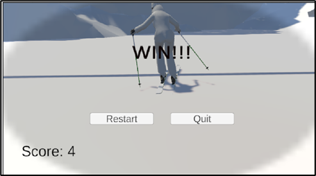

# 🎿 Ski Game

A fun skiing game built with **Unity** using **C#**, where the player navigates down a snowy slope, avoids obstacles, and collects snowflakes for points.


## 📌 Features
- Sloped ground with realistic skiing effect
- Snowfall particle effect
- Collectible snowflakes to increase score
- Game over on hitting an obstacle
- Winning endpoint with score display

---

## 🛠️ Tech Stack
- **Game Engine:** Unity
- **Language:** C#
- **Platform:** Windows / WebGL

---

## 📷 Screenshots




---

## ▶️ How to Play
1. Use **Arrow Keys / WASD** to move the skier.
2. Collect snowflakes to increase your score.
3. Avoid hitting obstacles.
4. Reach the endpoint to win!

---

## 📦 How to Run
1. Download the repository:
   ```bash
   git clone https://github.com/tejasri-k9/Ski-Game.git

